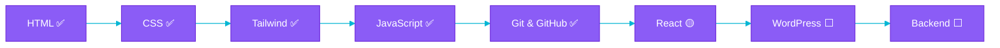

### 👩‍💻 About Me

I started with a blank HTML file and a lot of curiosity. Since then I've taught myself CSS, Tailwind, and JavaScript, picked up Git & GitHub along the way, and I'm currently deep in **React** — working toward a full **MERN stack** skill set.

- 🎯 **Goal:** Full-Stack Web Developer
- 📍 Based in Lahore, Pakistan
- 🎓 Completing an ADP in Computer Science at Superior University
- 🔭 Right now: React — Phase 2 of a 10-phase self-built roadmap
- 🌱 Learning in public — every project ships with a README and a writeup

 

### 🧭 My Full-Stack Journey

| Stage | Status |
|---|---|
| HTML | ✅ Done |
| CSS | ✅ Done |
| Tailwind CSS | ✅ Done |
| JavaScript (ES6+) | ✅ Done |
| Git & GitHub | ✅ Done |
| React.js | 🟡 In progress — Phase 2 of 10 |
| WordPress | ⬜ Up next |
| Backend — Node.js / Express / MongoDB | ⬜ Planned |

 

### 🛠️ Tech Stack

 

### 📌 Featured Projects

| Project | Stack | Description |
|---|---|---|
| **ReelFind** | JavaScript, TMDB API | Movie discovery app — browse and search films using live data from The Movie Database |
| **Shakeel Mehmood Portfolio** | HTML/CSS/JS, Firebase | Client project for a 3D/2D designer — orbiting tech-icon hero animation, Firebase Auth + Realtime DB, Cloudinary. [Live site →](https://bright-cheesecake-fd8477.netlify.app) |
| **GitHub User Finder** | JavaScript, REST API | Looks up GitHub profiles using the GitHub API |
| **Kanban Board** | Vanilla JS | Drag-and-drop task board — final vanilla JS project before moving to React |

 

### 📊 GitHub Stats

 

### 🔗 Connect

